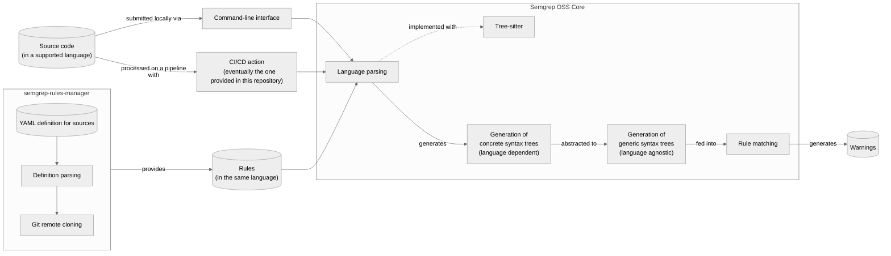

<p align="center">
    
</p>
<h2 align="center">Manager of third-party sources of Semgrep rules</h2>
<p align="center" float="left">
    <a href="https://snapcraft.io/semgrep-rules-manager">
        
    </a>
    &nbsp; &nbsp;
    <a href="https://pypi.org/project/semgrep_rules_manager/">
        
    </a>
    &nbsp; &nbsp;
    <a href="https://semgrep.iosifache.me">
        
    </a>
    &nbsp; &nbsp;
    <a href="https://github.com/marketplace/actions/semgrep-x-semgrep-rules-manager">
        
    </a>
</p>

## Description

Although that there is an open source repository containing community rules, some Semgrep users prefer to keep their custom rules in repositories that they manage.

The goal of **`semgrep-rules-manager`** is to collect **high-quality Semgrep rules from third-party sources**. It allows you to examine information about a source, download it, and check for and retrieve remote updates. If a downloaded source no longer meets your requirements, `semgrep-rules-manager` can handle deletion procedures.

## How it works



## Included rules

[This online search engine](https://semgrep.iosifache.me) allows you to explore the rules included in `semgrep-rules-manager`.

## Included sources

All sources in `semgrep-rules-manager` are defined in `semgrep_rules_manager/data/sources.yaml`. They are listed in the table below.

| Identifier    | Rules per Language                                                                                                                                                                                                                                                                                                                                                                                           | Author         | License   |
|---------------|--------------------------------------------------------------------------------------------------------------------------------------------------------------------------------------------------------------------------------------------------------------------------------------------------------------------------------------------------------------------------------------------------------------|----------------|-----------|
| `community`   | 374 for Python, 362 for Terraform, 237 for Regex, 210 for JavaScript, 204 for TypeScript, 126 for Java, 107 for YAML, 94 for Go, 93 for Generic, 87 for Ruby, 59 for PHP, 50 for Solidity, 49 for C#, 37 for Dockerfile, 34 for OCaml, 25 for Scala, 24 for JSON, 19 for Kotlin, 17 for C, 12 for Apex, 11 for Rust, 9 for Bash, 7 for Elixir, 7 for Swift, 5 for Clojure, 4 for HTML, 1 for Dart, 1 for Lua | Semgrep        | LGPL 2.1  |
| `gitlab`      | 101 for Java, 96 for JavaScript, 88 for Scala, 81 for Python, 62 for C, 62 for C++, 58 for Kotlin, 40 for Ruby, 27 for Go, 22 for C#, 14 for TypeScript, 9 for PHP, 5 for Swift, 2 for Generic                                                                                                                                                                                                               | GitLab         | MIT       |
| `trailofbits` | 24 for Python, 17 for YAML, 16 for Go, 11 for Generic, 9 for JavaScript, 9 for TypeScript, 2 for Java, 2 for Kotlin, 1 for Rust                                                                                                                                                                                                                                                                              | Trail of Bits  | AGPL-3.0  |
| `0xdea`       | 47 for C++, 46 for C, 1 for Generic                                                                                                                                                                                                                                                                                                                                                                          | Marco Ivaldi   | MIT       |
| `elttam`      | 40 for Java, 15 for Generic, 7 for YAML, 3 for JavaScript, 3 for Go, 2 for TypeScript, 1 for Python, 1 for Kotlin, 1 for C#, 1 for C, 1 for PHP                                                                                                                                                                                                                                                              | elttam         | MIT       |
| `kondukto`    | 5 for Dockerfile, 5 for PHP, 3 for Go, 3 for Java                                                                                                                                                                                                                                                                                                                                                            | Kondukto       |           |
| `dgryski`     | 66 for Go                                                                                                                                                                                                                                                                                                                                                                                                    | Damian Gryski  | MIT       |
| `dotta`       | 7 for PHP, 3 for Kotlin, 1 for Java                                                                                                                                                                                                                                                                                                                                                                          | Federico Dotta | MIT       |
| `hashicorp`   | 4 for Terraform, 1 for Generic                                                                                                                                                                                                                                                                                                                                                                               | Hashicorp      | MPL-2.0   |

## Installation in CI

### GitHub

The tool is available as [a GitHub action](https://github.com/marketplace/actions/semgrep-x-semgrep-rules-manager) and can be easily embedded into a repository to run Semgrep with all rules available in `semgrep-rules-manager`. Just embed the following step into your workflow definition file: 

```yaml
- name: Semgrep x semgrep-rules-manager
  uses: iosifache/semgrep-rules-manager
```

## Local installation

[Snap](https://snapcraft.io/semgrep-rules-manager) (`snap install semgrep-rules-manager`) or [pip](https://pypi.org/project/semgrep_rules_manager/) (`pip install semgrep-rules-manager`) are the simplest ways to install `semgrep-rules-manager`.

[](https://snapcraft.io/semgrep-rules-manager)

If you don't want to use a package management, simply clone this repository and install Poetry as well as the Python dependencies (`poetry install`).

> See also: [Poetry | Installation](https://python-poetry.org/docs/#installation)

## Usage

1. Install `semgrep`: `snap install semgrep`
2. Install `semgrep-rules-manager`: `snap install semgrep-rules-manager`
3. Get help:

    ```bash
    $ semgrep-rules-manager --help
    Usage: semgrep-rules-manager [OPTIONS] COMMAND [ARGS]...

    Manages third-party sources of Semgrep rules.

    Options:
    --dir PATH  Directory in which the Semgrep rules are stored  [required]
    --help      Show this message and exit.

    Commands:
    download  Downloads sources.
    list      Lists sources.
    remove    Removes downloaded sources.
    sync      Syncs downloaded sources.
    ```

4. Download a source:

    ```bash
    $ semgrep-rules-manager --dir /home/iosifache/semgrep-rules download --source 0xdea
    ✅ The source was successfully downloaded.
    ```

5. List all sources:

    ```bash
    $ semgrep-rules-manager --dir /home/iosifache/semgrep-rules list     
                                                    Available sources of Semgrep rules                                                 
    ┏━━━━━━━━━━━━━┳━━━━━━━━━━━━━━━━━━━━━━━━━━━━━━━━━━━━━━━━━━━━━━━━━━━━━━━━━━━━━━━━━━┳━━━━━━━━━━━━━━━┳━━━━━━━━━━━━┳━━━━━━━━━━━━━━━━━━━━┓
    ┃ Identifier  ┃ Description                                                      ┃ Author        ┃ Downloaded ┃ Synced with remote ┃
    ┡━━━━━━━━━━━━━╇━━━━━━━━━━━━━━━━━━━━━━━━━━━━━━━━━━━━━━━━━━━━━━━━━━━━━━━━━━━━━━━━━━╇━━━━━━━━━━━━━━━╇━━━━━━━━━━━━╇━━━━━━━━━━━━━━━━━━━━┩
    │ community   │ Official repository of rules                                     │ Semgrep       │ ❌         │ ❌                 │
    │ gitlab      │ Rules used in GitLab SAST                                        │ GitLab        │ ❌         │ ❌                 │
    │ trailofbits │ Rules used in the audits, research and projects of Trail of Bits │ Trail of Bits │ ❌         │ ❌                 │
    │ 0xdea       │ Custom rules written by Marco Ivaldi                             │ Marco Ivaldi  │ ✅         │ ✅                 │
    │ elttam      │ Custom rules used in elttam                                      │ elttam        │ ❌         │ ❌                 │
    │ kondukto    │ Custom rules used in Kondukto                                    │ Kondukto      │ ❌         │ ❌                 │
    └─────────────┴──────────────────────────────────────────────────────────────────┴───────────────┴────────────┴────────────────────┘
    ```

6. List only the downloaded source:

    ```bash
    $ semgrep-rules-manager --dir /home/iosifache/semgrep-rules list --source 0xdea
    Identifier: 0xdea
    Description: Custom rules written by Marco Ivaldi
    Rules per language: 40 for C++, 39 for C, 1 for Generic
    Repository URL: https://github.com/0xdea/semgrep-rules
    Repository brach: main
    Author: Marco Ivaldi
    License: MIT
    Downloaded: ✅ (in /home/iosifache/semgrep-rules/0xdea)
    Synced: ✅ because fd3bcad54de9dc76d4a8780a4125d42475d560ce (local) == fd3bcad54de9dc76d4a8780a4125d42475d560ce (remote)
    ```

7. Use the downloaded source to scan a codebase: `semgrep --config /home/iosifache/semgrep-rules .`
8. Sync the source:

    ```bash
    $ semgrep-rules-manager --dir /home/iosifache/semgrep-rules sync --source 0xdea
    ✅ All sources are already synced.
    ```
9. Remove the source

    ```bash
    $ semgrep-rules-manager --dir /home/iosifache/semgrep-rules remove --source 0xdea
    ✅ The source was successfully deleted.
    ```

## Acknowledgements

Thanks to the [Semgrep team](https://semgrep.dev) for making their work available to the open source community!

This project's logo was created with [Adobe Firefly](https://firefly.adobe.com).
